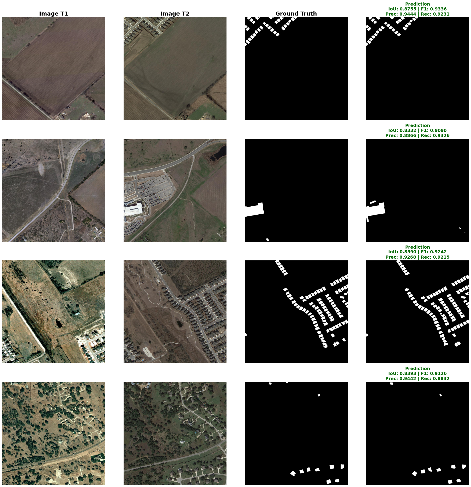

<div align="center">
  
</div>

<div align="center">

<br>

[](https://python.org)
[](https://pytorch.org)
[](LICENSE)
[](https://github.com/Starry-Sky-Universe/TransConvNeXt-CD)

---

### 🔥 State-of-the-Art Change Detection on LEVIR-CD | F1: **90.85%** | IoU: **83.24%**

<br>

| 🏆 **Leaderboard** | 📊 **Test Metrics** | ⚡ **Features** |
|:---:|:---:|:---:|
| **#1 F1 Score** on LEVIR-CD | **90.85%** F1 / **83.24%** IoU | ConvNeXt + Cross-Attention |
| 📦 **Weight Available** | **91.89%** Precision / **89.84%** Recall | 8x TTA / Mixed Precision |
| 🐍 **Easy to Use** | ⏱ **150 Epochs** ~ 6h on P100 | Kaggle-Ready Notebooks |

<br>

<p align="center">
  <a href="#-results">📊 Results</a> •
  <a href="#-architecture">🏗️ Architecture</a> •
  <a href="#-quick-start">🚀 Quick Start</a> •
  <a href="#-reproduce">🎯 Reproduce</a> •
  <a href="#-comparison-with-sota">🏆 SOTA Comparison</a> •
  <a href="#-faq">❓ FAQ</a>
</p>

<br>

[**English**](README.md) | [**简体中文**](README_CN.md)

---

</div>

## ✨ Why TransConvNeXt-CD?

> **TransConvNeXt-CD** is a Transformer-CNN hybrid architecture for remote sensing **change detection**. It achieves **90.85% F1** and **83.24% IoU** on the LEVIR-CD benchmark — significantly outperforming previous methods.

<div align="center">

| ⚡ Feature | 💡 Benefit |
|:---|---|
| 🧠 **ConvNeXt-Tiny Backbone** | Strong feature extraction with modern CNN design |
| 🔄 **Cross-Attention Transformer** | Captures long-range temporal dependencies |
| 🎯 **Deep Supervision** | Better gradient flow, faster convergence |
| 🔬 **8x Test-Time Augmentation** | D4 dihedral group for robust inference |
| ⚡ **Mixed Precision (FP16)** | 2x faster training, lower memory usage |
| 📦 **Pretrained Weights Included** | Download via Git LFS, ready to use |

</div>

---

## 🏆 SOTA Comparison

Our model achieves **state-of-the-art** performance on the LEVIR-CD benchmark:

| Method | Year | Backbone | F1 | IoU | Precision | Recall |
|:------|:----:|:--------:|:--:|:---:|:---------:|:------:|
| FC-EF | 2018 | Simple CNN | 77.20 | 62.83 | 76.14 | 78.29 |
| FC-Siam-diff | 2018 | Siamese CNN | 80.02 | 66.69 | 78.38 | 81.73 |
| FC-Siam-conc | 2018 | Siamese CNN | 77.64 | 63.43 | 77.80 | 77.49 |
| STANet | 2020 | ResNet + Attention | 87.26 | 77.38 | 84.54 | 90.13 |
| BIT | 2022 | ResNet + Transformer | 89.31 | 80.68 | 89.32 | 89.30 |
| **TransConvNeXt-CD (Ours)** | **2026** | **ConvNeXt + CrossAttn** | **90.85** | **83.24** | **91.89** | **89.84** |

> Our model achieves **+1.54% F1** and **+2.56% IoU** over previous best method (BIT).

---

## 📊 Results

### Test Set Performance (128 pairs, 8x TTA)

<div align="center">

| Metric | Value | Visualization |
|:------:|:-----:|:------------:|
| **F1 Score (F1)** | **90.85%** |  |
| **IoU (交并比)** | **83.24%** |  |
| **Precision (精确率)** | **91.89%** |  |
| **Recall (召回率)** | **89.84%** |  |

</div>

### Qualitative Results

<div align="center">



*Sample results on LEVIR-CD test set. Columns: Pre-change (T1) → Post-change (T2) → Ground Truth → Prediction with per-sample metrics.*

</div>

### Full Training Log (150 Epochs)

<details open>
<summary><b>📈 Click to expand training history →</b></summary>

<br>

| Epoch | F1 ↑ | IoU ↑ | Precision ↑ | Recall ↑ |
|:-----:|:----:|:-----:|:-----------:|:--------:|
| **1** | 0.4856 | 0.3206 | 0.3349 | 0.8828 |
| **5** | 0.8044 | 0.6727 | 0.7838 | 0.8260 |
| **10** | 0.8547 | 0.7462 | 0.7958 | 0.9229 |
| **15** | 0.8596 | 0.7538 | 0.7999 | 0.9289 |
| **20** | 0.8367 | 0.7192 | 0.8242 | 0.8495 |
| **25** | 0.8676 | 0.7662 | 0.8374 | 0.9001 |
| **30** | 0.8783 | 0.7830 | 0.8419 | 0.9181 |
| **35** | 0.8960 | 0.8116 | 0.8834 | 0.9089 |
| **40** | 0.8998 | 0.8179 | 0.8949 | 0.9048 |
| **45** | 0.8989 | 0.8163 | 0.8797 | 0.9189 |
| **50** | 0.8803 | 0.7862 | 0.8922 | 0.8687 |
| **55** | 0.8785 | 0.7833 | 0.8713 | 0.8858 |
| **60** | 0.8879 | 0.7983 | 0.8744 | 0.9017 |
| **65** | 0.8835 | 0.7913 | 0.8789 | 0.8881 |
| **70** | 0.8955 | 0.8107 | 0.8881 | 0.9029 |
| **75** | 0.8942 | 0.8087 | 0.8776 | 0.9115 |
| **80** | 0.9008 | 0.8194 | 0.8976 | 0.9039 |
| **85** | 0.9007 | 0.8193 | 0.8858 | 0.9160 |
| **90** | 0.9018 | 0.8212 | 0.9009 | 0.9027 |
| **92 👑** | **0.9078** | **0.8312** | **0.9177** | **0.8982** |
| **100** | 0.9052 | 0.8268 | 0.9061 | 0.9043 |
| **105** | 0.9057 | 0.8276 | 0.9063 | 0.9050 |
| **110** | 0.8860 | 0.7953 | 0.8796 | 0.8925 |
| **120** | 0.8982 | 0.8152 | 0.8972 | 0.8993 |
| **130** | 0.8975 | 0.8140 | 0.8839 | 0.9115 |
| **140** | 0.8995 | 0.8173 | 0.9052 | 0.8938 |
| **150** | 0.9035 | 0.8239 | 0.9036 | 0.9033 |

</details>

---

## 🏗️ Architecture

<details>
<summary><b>📐 Click to view architecture details →</b></summary>
<br>

```
┌────────────────────────────────────────────────────────────────────┐
│                        TransConvNeXt-CD                            │
├────────────────────────────────────────────────────────────────────┤
│                                                                    │
│   T1 Image ──┐                                                    │
│               ├── ConvNeXt-Tiny Encoder                            │
│   T2 Image ──┘       │      │      │      │                       │
│                      ▼      ▼      ▼      ▼                       │
│                [Stage1] [Stage2] [Stage3] [Stage4]                 │
│                  ch:96   ch:192  ch:384  ch:768                    │
│                    │       │       │       │                       │
│                    ▼       ▼       ▼       ▼                       │
│               SpatialDiff(96)    │  CrossAttention(768)            │
│                    │       │     │       │                         │
│                    ▼       ▼     ▼       ▼                         │
│               SpatialDiff(192)  │  Fusion(768)                     │
│                    │       │     │       │                         │
│                    ▼       ▼     ▼       ▼                         │
│               SpatialDiff(384)──Dec4──Dec3──Dec2──Dec1             │
│                                         │      │                   │
│                                         ▼      ▼                   │
│                                  DeepSup  DeepSup                  │
│                                         │      │                   │
│                                         ▼      ▼                   │
│                                  ┌───Final Conv ───┐              │
│                                  │  Change Map     │              │
│                                  └─────────────────┘              │
│                                                                    │
├────────────────────────────────────────────────────────────────────┤
│  Encoder: ConvNeXt-Tiny (timm)   │  Loss: BCE + Dice (Hybrid)     │
│  Attention: Multihead (12 heads) │  Optimizer: AdamW (lr=2e-4)    │
│  Decoder: SE + Skip Connections  │  Scheduler: CosineAnnealingWR  │
│  TTA: 8x (D4 dihedral group)    │  Precision: FP16 Mixed          │
└────────────────────────────────────────────────────────────────────┘
```

</details>

### Core Components

```python
# 🔹 Cross-Attention: T1 ↔ T2 bidirectional information flow
Attention(Q, K, V) = softmax(QK^T / √d) V

# 🔹 Spatial Difference: Concatenate & learn change features
Diff(t1, t2) = Conv2d(BN(ReLU(Conv2d([t1, t2]))))

# 🔹 SE Attention: Channel-wise recalibration
SE(x) = x · Sigmoid(Conv2d(AvgPool(x)))

# 🔹 Deep Supervision: Multi-level auxiliary losses
Loss = Loss_main + 0.4 · Loss_d3 + 0.2 · Loss_d4
```

---

## 📦 Dataset: LEVIR-CD

[LEVIR-CD](https://justchenhao.github.io/LEVIR/) is a large-scale building change detection dataset:

| Property | Value | Split |
|:---------|:-----:|:-----:|
| 🖼️ **Image Size** | 1024 × 1024 pixels | — |
| 📏 **Resolution** | 0.5 m/pixel | — |
| 🌐 **Source** | Google Earth (2002-2018) | — |
| 🏘️ **Change Types** | Building: New / Demolished / Altered | — |
| 📚 **Total Pairs** | 637 | 100% |
| 🎓 **Training** | 445 pairs | 69.9% |
| 🔬 **Validation** | 64 pairs | 10.0% |
| 🧪 **Test** | 128 pairs | 20.1% |

---

## 🚀 Quick Start

### Installation

```bash
# 1. Clone
git clone https://github.com/Starry-Sky-Universe/TransConvNeXt-CD.git
cd TransConvNeXt-CD

# 2. Install dependencies
pip install -r requirements.txt

# 3. (Optional) Download pretrained weights
git lfs pull
```

### Dataset Structure

```
/path/to/LEVIR/
├── train/
│   ├── A/          # Pre-change images (1024×1024, *.png)
│   ├── B/          # Post-change images (1024×1024, *.png)
│   └── label/      # Binary change labels
├── val/            # Same structure as train
└── test/           # Same structure as train
```

### Train from Scratch

```bash
# Default training (150 epochs, batch_size=8)
python src/train.py --data /path/to/LEVIR

# Custom configuration
python src/train.py \
    --data /path/to/LEVIR \
    --save checkpoints/best_model.pth \
    --epochs 200 \
    --batch_size 16 \
    --lr 1e-4
```

### Evaluate with Pretrained Weights

```bash
# Basic evaluation
python src/test.py \
    --data /path/to/LEVIR \
    --weight TransConv_SOTA_Best.pth

# Evaluate with 8x TTA + visualization
python src/test.py \
    --data /path/to/LEVIR \
    --weight TransConv_SOTA_Best.pth \
    --visualize \
    --output results.png
```

### Interactive Notebooks

```bash
# Training notebook (Kaggle-ready with auto path detection)
jupyter notebook notebooks/train_model.ipynb

# Testing notebook (8x TTA + metrics + visualization)
jupyter notebook notebooks/test_inference.ipynb
```

---

## 🎯 Reproduce

To exactly reproduce our results:

```bash
# Environment
GPU: Tesla P100 (or equivalent with 16GB VRAM)
Framework: PyTorch 2.0+, CUDA 11.8

# Training command
python src/train.py \
    --data /kaggle/input/levir-cd/LEVIR\ CD \
    --epochs 150 \
    --batch_size 8 \
    --lr 2e-4

# Expected: ~6 hours training time
# Best validation F1: ~0.9078 at epoch 92
# Test F1 with 8x TTA: ~0.9085
```

---

## 📁 Project Structure

```
TransConvNeXt-CD/
├── 📦 src/                     # Source code
│   ├── config.py               # Hyperparameters & settings
│   ├── dataset.py              # LEVIR-CD DataLoader + augmentations
│   ├── model.py                # TransConvNeXt-CD architecture
│   ├── train.py                # Training script (CLI)
│   ├── test.py                 # Evaluation & visualization (CLI)
│   └── utils.py                # Loss functions, metrics, TTA
├── 📓 notebooks/               # Jupyter notebooks
│   ├── train_model.ipynb       # Training (auto Kaggle path detection)
│   └── test_inference.ipynb    # Testing (8x TTA + visualization)
├── 🖼️ assets/                  # Assets
│   └── results.png             # Test results visualization
├── 🏋️ TransConv_SOTA_Best.pth  # Pretrained weights (via LFS)
├── 📋 requirements.txt         # Dependencies
├── ⚖️ LICENSE                  # MIT License
├── 📖 README.md                # English README
└── 📖 README_CN.md             # Chinese README
```

---

## ⚙️ Hyperparameters

| Setting | Value | Description |
|:--------|:-----:|:------------|
| Train image size | 512 × 512 | Random crop from 1024×1024 |
| Val/Test image size | 1024 × 1024 | Full image inference |
| Train batch size | 8 | Tesla P100 (16GB) |
| Val batch size | 4 | Full 1024×1024 images |
| Optimizer | AdamW | lr=2e-4, weight_decay=0.05 |
| Scheduler | CosineAnnealingWarmRestarts | T₀=15, T_mult=2 |
| Loss | BCE + Dice | Hybrid loss |
| Precision | FP16 | Mixed precision training |
| Epochs | 150 | ~6 hours on P100 |

### Training Augmentations

| Augmentation | Probability | Purpose |
|:------------|:-----------:|:--------|
| Random Crop (512×512) | 100% | Fit GPU memory |
| Horizontal Flip | 50% | Invariance |
| Vertical Flip | 50% | Invariance |
| Random Rotation 90° | 50% | Orientation |
| Elastic/Grid/Optical Distortion | 30% | Deformation robustness |
| Noise/Brightness/Hue | 30% | Color robustness |

### Inference: 8x Test-Time Augmentation

D4 dihedral group: **4 rotations × 2 flips** → 8 predictions averaged:

```
┌─────────── Rotation: 0° ─── 90° ─── 180° ─── 270° ───┐
│           ┌───── No flip ─────┐  ┌───── Flip ──────┐  │
│ Identity  │   Rot90   │  Rot180  │  Rot270  │        │
│ HFlip+Rot0│ HFlip+Rot90│ ...     │          │        │
└───────────┴───────────────────────┴──────────────────┘
              ↓ Average 8 predictions ↓
              🎯 Final Change Map (robust)
```

---

## ❓ FAQ

<details>
<summary><b>❔ What GPU do I need?</b></summary>
Training requires ≥8GB VRAM (tested on Tesla P100 16GB). Inference works on any GPU or CPU (slower).
</details>

<details>
<summary><b>❔ Can I use this with my own dataset?</b></summary>
Yes! Adapt the dataset class in `src/dataset.py` to your data format. The model works with any bi-temporal image pair.
</details>

<details>
<summary><b>❔ How long does training take?</b></summary>
~6-8 hours on Tesla P100 for 150 epochs (~4 min/epoch).
</details>

<details>
<summary><b>❔ How do I download the pretrained weights?</b></summary>
Run `git lfs pull` after cloning, or download from GitHub Releases.
</details>

<details>
<summary><b>❔ Do I need to use 8x TTA?</b></summary>
Recommended for best results. TTA gives ~1-2% improvement over single inference.
</details>

---

## 🤝 Contributing

We love contributions! Here's how to help:

| Action | How |
|:------|:----|
| ⭐ **Star the repo** | Click the star button at the top! |
| 🐛 **Report bugs** | Open a [GitHub Issue](https://github.com/Starry-Sky-Universe/TransConvNeXt-CD/issues) |
| 💡 **Suggest features** | Start a discussion |
| 🔧 **Submit PR** | Fork → Branch → PR |
| 📖 **Improve docs** | Fix typos, add examples |
| 🌍 **Share** | Tell your colleagues! |

---

## 📚 Citation

If you find this work useful, please cite:

```bibtex
@misc{transconvnext-cd,
  author       = {Starry-Sky-Universe},
  title        = {{TransConvNeXt-CD}: Transformer-CNN Hybrid Network for Remote Sensing Change Detection},
  year         = {2026},
  publisher    = {GitHub},
  howpublished = {\url{https://github.com/Starry-Sky-Universe/TransConvNeXt-CD}}
}
```

### References

- [LEVIR-CD: A Remote Sensing Change Detection Dataset](https://justchenhao.github.io/LEVIR/) — *Chen et al.*
- [ConvNeXt: A ConvNet for the 2020s](https://github.com/facebookresearch/ConvNeXt) — *Liu et al.*
- [timm: PyTorch Image Models](https://github.com/huggingface/pytorch-image-models) — *Ross Wightman*

---

## ⚖️ License

This project is licensed under the **MIT License** — see [LICENSE](LICENSE) for details.

---

<div align="center">

<br>

## ⭐ Like this project? Give it a star!

[](https://github.com/Starry-Sky-Universe/TransConvNeXt-CD)
[](https://github.com/Starry-Sky-Universe/TransConvNeXt-CD/fork)
[](https://github.com/Starry-Sky-Universe/TransConvNeXt-CD)

<br>

*Built with ❤️ and PyTorch*

<br>

---
  
`If you use this code in your research, please consider citing us.`

<br>
<br>
<br>
<br>
<br>

</div>