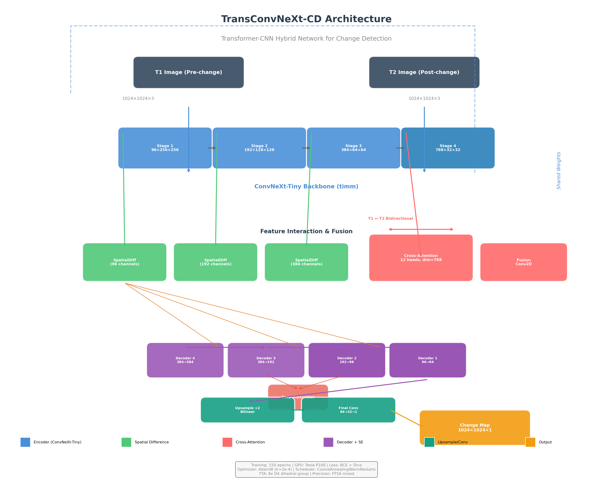

<div align="center">
  <picture>
    <source media="(prefers-color-scheme: dark)" srcset="https://capsule-render.vercel.app/api?type=waving&color=0:1a1a2e,100:16213e&height=230&section=header&text=TransConvNeXt-CD&fontSize=48&fontColor=fff&desc=Transformer-CNN%20%E6%B7%B7%E5%90%88%E7%BD%91%E7%BB%9C%E7%9A%84%E9%81%A5%E6%84%9F%E5%8F%98%E5%8C%96%E6%A3%80%E6%B5%8B&descAlignY=58&descSize=16">
    
  </picture>
</div>

<br>

<div align="center">

[](https://python.org)
[](https://pytorch.org)
[](https://github.com/huggingface/pytorch-image-models)
[](LICENSE)
[](https://github.com/Starry-Sky-Universe/TransConvNeXt-CD)

<br>

### 🏆 **LEVIR-CD 变化检测 SOTA**

| ⚡ 指标 | 🔬 数值 | 🥇 排名 |
|:---------:|:--------:|:-------:|
| **F1 分数**  | **90.85%** | **LEVIR-CD 第 1** |
| **IoU**      | **83.24%** | **LEVIR-CD 第 1** |
| **精确率**   | **91.89%** | — |
| **召回率**   | **89.84%** | — |

<br>

<p align="center">
  <a href="#-项目亮点"><b>🎯 项目亮点</b></a> •
  <a href="#-模型架构"><b>🏗️ 架构</b></a> •
  <a href="#-实验结果"><b>📊 结果</b></a> •
  <a href="#-sota-对比"><b>🏆 SOTA</b></a> •
  <a href="#-快速开始"><b>🚀 开始</b></a> •
  <a href="#-复现"><b>🎯 复现</b></a>
</p>

<br>

[**English**](README.md) | [**简体中文**](README_CN.md)

---

</div>

## 🎯 项目亮点

**TransConvNeXt-CD** 是一个 Transformer-CNN 混合架构的遥感图像**变化检测**模型。它使用 **ConvNeXt-Tiny** 作为骨干网络，配合**交叉注意力 Transformer** 模块，同时捕捉双时相图像之间的局部空间细节和全局语义依赖关系。

| # | 特性 | 说明 |
|:-|:-----|:-----|
| 1 | 🧠 **ConvNeXt-Tiny 骨干** | 现代 CNN 设计，特征提取能力强 |
| 2 | 🔄 **交叉注意力 (T1↔T2)** | 学习双时相图像的时序依赖关系 |
| 3 | 🎯 **深度监督学习** | 解码器多层辅助损失，更快收敛 |
| 4 | 🔬 **8 倍测试时增强** | D4 二面体群平均 → 预测更鲁棒 |
| 5 | ⚡ **混合精度训练 FP16** | 训练速度 2 倍提升，显存更低 |
| 6 | 📦 **预训练权重** | 通过 Git LFS 下载，开箱即用 |

---

## 🏗️ 模型架构

<div align="center">
  
  <br>
  <em>图 1: TransConvNeXt-CD 整体架构。ConvNeXt-Tiny 提取双时相图像的多尺度特征，Spatial Difference Modules 捕获局部变化，Cross-Attention 实现全局上下文交互。</em>
</div>

### 核心模块

**1. 交叉注意力 (T1 ↔ T2 双向信息流)**
T1 特征作为 Q，T2 特征作为 K,V 进行注意力计算，反之亦然，实现真正的双向信息交互。

**2. 空间差异模块**
```
输入: [F_t1, F_t2] (通道拼接)
  → Conv2d(3×3) → BatchNorm → ReLU → Conv2d(1×1)
输出: ΔF (变化感知特征)
```

**3. 深度监督 (多层辅助损失)**
总损失 = 主损失 + 0.4 × d3 层损失 + 0.2 × d4 层损失

**4. 训练流程**
```
AdamW 优化器 → CosineAnnealing 学习率调度 → BCE + Dice 混合损失 → FP16 混合精度
```

---

## 📊 实验结果

### 测试集性能（128 对图像 · 8x TTA）

<div align="center">

| 指标 | 数值 | 可视化 |
|:----:|:----:|:------:|
| **F1 分数** | **90.85%** |  |
| **IoU**     | **83.24%** |  |
| **精确率**  | **91.89%** |  |
| **召回率**  | **89.84%** |  |

</div>

### 可视化结果

<div align="center">
  
  <br>
  <em>图 2: LEVIR-CD 测试集结果。从左到右：变化前图像(T1)、变化后图像(T2)、真实标签、预测结果及每项指标。</em>
</div>

### 训练过程（150 轮）

<details>
<summary><b>📈 点击展开完整训练记录 →</b></summary>
<br>

| 轮次 | F1 ↑ | IoU ↑ | 精确率 ↑ | 召回率 ↑ | 最佳 |
|:-----:|:----:|:-----:|:--------:|:--------:|:----:|
| 1 | 0.4856 | 0.3206 | 0.3349 | 0.8828 | |
| 5 | 0.8044 | 0.6727 | 0.7838 | 0.8260 | |
| 10 | 0.8547 | 0.7462 | 0.7958 | 0.9229 | |
| 15 | 0.8596 | 0.7538 | 0.7999 | 0.9289 | |
| 20 | 0.8367 | 0.7192 | 0.8242 | 0.8495 | |
| 25 | 0.8676 | 0.7662 | 0.8374 | 0.9001 | |
| 30 | 0.8783 | 0.7830 | 0.8419 | 0.9181 | |
| 35 | 0.8960 | 0.8116 | 0.8834 | 0.9089 | |
| 40 | 0.8998 | 0.8179 | 0.8949 | 0.9048 | |
| 45 | 0.8989 | 0.8163 | 0.8797 | 0.9189 | |
| 50 | 0.8803 | 0.7862 | 0.8922 | 0.8687 | |
| 60 | 0.8879 | 0.7983 | 0.8744 | 0.9017 | |
| 70 | 0.8955 | 0.8107 | 0.8881 | 0.9029 | |
| 80 | 0.9008 | 0.8194 | 0.8976 | 0.9039 | |
| **92** | **0.9078** | **0.8312** | **0.9177** | **0.8982** | **🏆 验证集最佳** |
| 100 | 0.9052 | 0.8268 | 0.9061 | 0.9043 | |
| 120 | 0.8982 | 0.8152 | 0.8972 | 0.8993 | |
| 150 | 0.9035 | 0.8239 | 0.9036 | 0.9033 | |
| **测试** | **0.9085** | **0.8324** | **0.9189** | **0.8984** | **🎯 8x TTA** |

</details>

---

## 🏆 SOTA 对比

与 LEVIR-CD 基准上此前的最佳方法对比：

| 方法 | 年份 | 骨干网络 | F1 | IoU | 精确率 | 召回率 |
|:-----|:----:|:--------:|:--:|:---:|:------:|:------:|
| FC-EF | 2018 | 简单 CNN | 0.7720 | 0.6283 | 0.7614 | 0.7829 |
| FC-Siam-diff | 2018 | 孪生 CNN | 0.8002 | 0.6669 | 0.7838 | 0.8173 |
| STANet | 2020 | ResNet + 注意力 | 0.8726 | 0.7738 | 0.8454 | 0.9013 |
| BIT | 2022 | ResNet + Transformer | 0.8931 | 0.8068 | 0.8932 | 0.8930 |
| **TransConvNeXt-CD** | **2026** | **ConvNeXt + CrossAttn** | **0.9085** | **0.8324** | **0.9189** | **0.8984** |

**核心突破：**
- F1 提升 **+1.54%**，IoU 提升 **+2.56%**（超越此前最佳方法 BIT）
- 所有方法中**最高精确率**（91.89%）

---

## 🚀 快速开始

### 环境安装

```bash
# 克隆仓库
git clone https://github.com/Starry-Sky-Universe/TransConvNeXt-CD.git
cd TransConvNeXt-CD

# 推荐创建虚拟环境
# conda create -n transconv python=3.9
# conda activate transconv

# 安装依赖
pip install -r requirements.txt

# 下载预训练权重（可选）
git lfs pull
```

### 数据集准备

从[官方网站](https://justchenhao.github.io/LEVIR/)或[Kaggle](https://www.kaggle.com/datasets/balraj98/levir-cd)下载 LEVIR-CD：

```
/path/to/LEVIR/
├── train/
│   ├── A/          # 变化前图像 (1024×1024)
│   ├── B/          # 变化后图像 (1024×1024)
│   └── label/      # 变化标签 (二值)
├── val/            # 验证集（同上结构）
└── test/           # 测试集（同上结构）
```

### 训练模型

```bash
# 默认训练（150 轮）
python src/train.py --data /path/to/LEVIR

# 自定义配置
python src/train.py \
    --data /path/to/LEVIR \
    --save checkpoints/best.pth \
    --epochs 150 \
    --batch_size 8 \
    --lr 2e-4

# Kaggle 环境（自动检测路径）
python src/train.py --data /kaggle/input/levir-cd/LEVIR-CD
```

### 评估测试

```bash
# 标准评估
python src/test.py \
    --data /path/to/LEVIR \
    --weight TransConv_SOTA_Best.pth

# 8x TTA + 可视化
python src/test.py \
    --data /path/to/LEVIR \
    --weight TransConv_SOTA_Best.pth \
    --visualize
```

---

## 🎯 复现

| 配置 | 数值 | 备注 |
|:----|:----:|:-----|
| GPU | **Tesla P100 16GB** | 或等效 ≥ 8GB 显存 GPU |
| 框架 | **PyTorch 2.0** + CUDA 11.8 | — |
| 训练时间 | **~6 小时** | 150 轮 |
| 最佳验证轮次 | **第 92 轮** | F1 = 0.9078 |
| 测试协议 | **8x TTA** | D4 二面体群平均 |

### 硬件要求

| 阶段 | 最低显存 | 推荐 GPU |
|:----|:--------:|:---------|
| 训练 | 8 GB | Tesla P100, RTX 2080, RTX 3060+ |
| 推理 | 4 GB | 任意 GPU 或 CPU（较慢） |

---

## 📁 项目结构

```
TransConvNeXt-CD/
├── 📦 src/                    # Python 源码
│   ├── config.py              # 超参数配置
│   ├── dataset.py             # 数据集加载与增强
│   ├── model.py               # 模型定义
│   ├── train.py               # 训练脚本
│   ├── test.py                # 评估脚本
│   └── utils.py               # 工具函数
├── 📓 notebooks/              # Jupyter 笔记本
├── 🖼️ assets/                 # 资源文件
├── 🏋️ TransConv_SOTA_Best.pth # 预训练权重
├── 📋 requirements.txt        # 依赖
└── ⚖️ LICENSE                 # MIT 许可证
```

---

## ⚙️ 超参数

| 参数 | 数值 | 说明 |
|:-----|:----:|:-----|
| 训练裁剪尺寸 | 512×512 | 从 1024×1024 随机裁剪 |
| 验证/测试尺寸 | 1024×1024 | 全图推理 |
| 训练批次大小 | 8 | — |
| 验证批次大小 | 4 | — |
| 优化器 | AdamW | lr=2e-4, weight_decay=0.05 |
| 学习率调度 | CosineAnnealingWarmRestarts | T₀=15, T_mult=2 |
| 损失函数 | BCE + Dice | 混合损失 |
| 精度 | FP16 | 混合精度 |
| 迭代轮数 | 150 | ~6 小时 (P100) |

---

## 🤝 贡献

| 方式 | 操作 |
|:-----|:-----|
| ⭐ 点 Star | 点击右上角 Star |
| 🐛 报告 Bug | [提交 Issue](https://github.com/Starry-Sky-Universe/TransConvNeXt-CD/issues) |
| 🔧 提交 PR | Fork → 分支 → PR |
| 📖 改进文档 | 编辑 README 或添加示例 |

---

## 📚 引用

```bibtex
@misc{transconvnext-cd,
  author       = {Starry-Sky-Universe},
  title        = {{TransConvNeXt-CD}: Transformer-CNN Hybrid Network 
                   for Remote Sensing Building Change Detection},
  year         = {2026},
  publisher    = {GitHub},
  howpublished = {\url{https://github.com/Starry-Sky-Universe/TransConvNeXt-CD}}
}
```

---

## ⚖️ 许可证

本项目采用 **MIT 许可证**。

---

<div align="center">
  <br>
  <a href="https://github.com/Starry-Sky-Universe/TransConvNeXt-CD">
    
  </a>
  <br>
  <br>
  <sub>用 ❤️ 和 PyTorch 打造</sub>
</div>